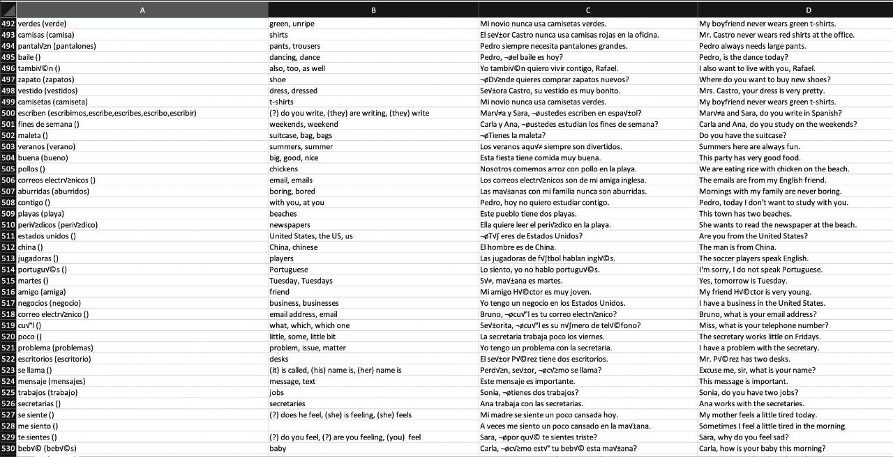
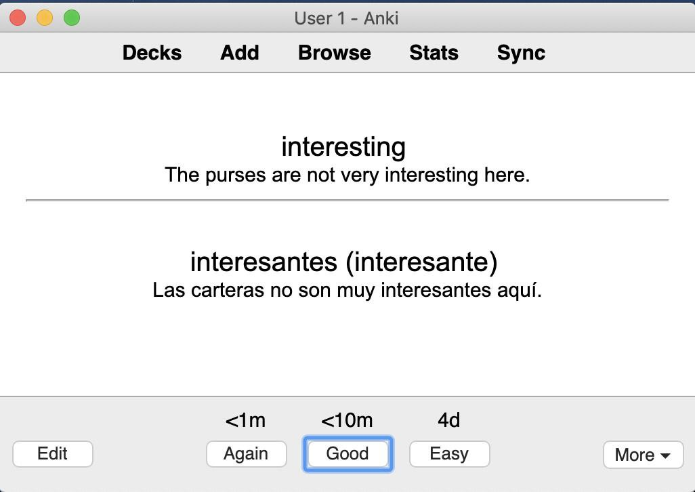

# duolingo-flashcards
Generate flashcards from known words learned on Duolingo

# Overview

Running the tool generates a .csv file with the following columns:

* Word in Spanish (or the language you want to learn) with alternate forms (such as feminine / masculine forms)
* Word in English (or your mother tongue)
* Example sentence in Spanish
* Example sentence translated in English

For instance, here is an overview of the generated CSV file:

Then, the CSV can be imported into Anki.

# Todo

* Auto-detect the languages configured by the user (mother tongue and language to learn)
* Add Text-to-speech
* Download the known words into JSON.
* Save a state of the collection: then run the script periodically and generate new flash cards for the newly learned words.
